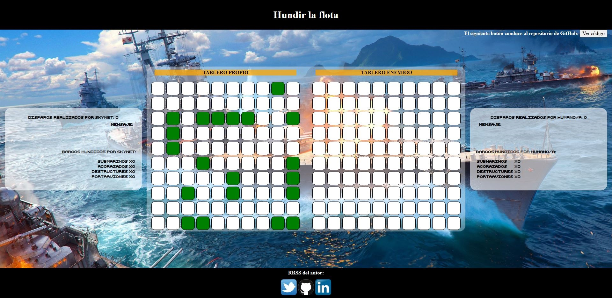
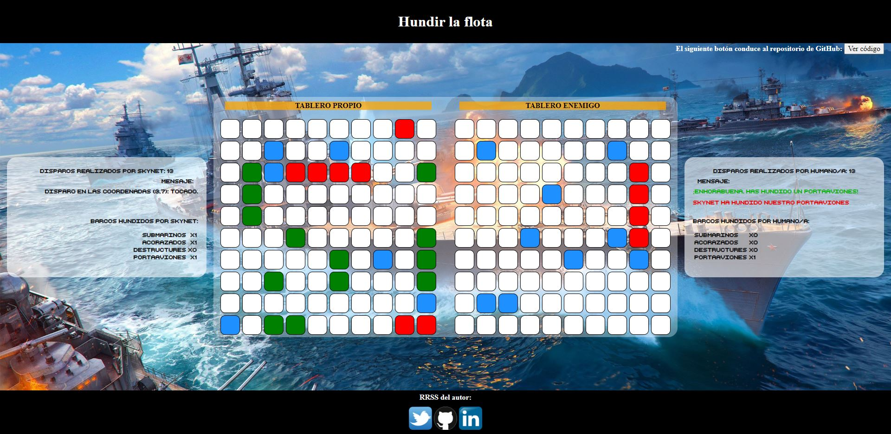
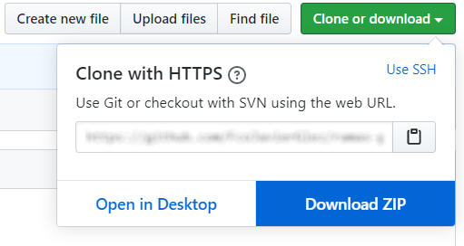
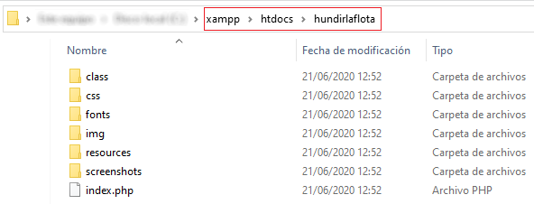
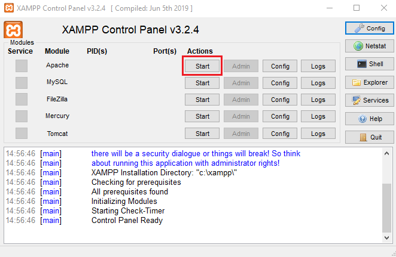

# Hundir la flota :ship: :boom: :speedboat:

<div style="text-align: left;">
    <a href="#" target="_blank">
        
    </a>
    
    
    <a href="https://twitter.com/intent/follow?screen_name=Fco_Javier_Glez" target="_blank">
        </a>
</div>

**Este proyecto ha sido creado únicamente con fines didactos**: Se trata del juego de *Hundir la Flota* con una IA que permite el modo para 1 jugador. Este proyecto ha sido implementado usando variables de sesión en PHP 7.4 y es compatible a partir de la versión 5.0 de PHP.

---

## El juego:

### Acceso al juego:

Para acceder al juego sin más complicación puedes acceder a través del siguiente enlace:

[Enlace al juego](http://cpd.iesgrancapitan.org:9118/~gosafr/cuarentena/hundirlaflota/index.php)

**Aviso importante:** Es probable que el acceso al juego no esté disponible durante los meses de julio y agosto.

### Imágenes:

  *A la izquierda nuestro tablero con nuestros barcos ubicados aleatoriamente, a la derecha la representación del tablero enemigo.*


  *Ejemplo de una partida en marcha.*

## Instrucciones de instalación

Existen varias opciones para la ejecución del proyecto, en cualquiera de ellas es necesario un servidor de páginas web, por ejemplo Apache 2, y del lenguaje de PHP. A continuación voy a explicar una de estas opciones, la que personalmente me parece la más rápida y cómoda de instalar:

### Instalación de xampp:

Para instalar xampp nos dirigimos al siguiente enlace: [descargar xampp](https://www.apachefriends.org/es/index.html) y elegimos la opción que se adecue a nuestro SO.

Una vez descargado procedemos a instalar, por defecto ya vienen incluídas la instalación de Apache2 y de PHP.

### Descarga e instalación del proyecto:
Para descargar el proyecto podemos ir al botón verde <span style="padding: 8px 12px; background-color: #279f43; color: white; width: max-content; border: 1px solid black; border-radius: 3px;">Clone or download</span> (ver más arriba) y a continuación pulsar en <span style="padding: 8px 30px; background-color: #0058bd; color: white; width: max-content;">Download Zip</span> como se muestra en la siguiente imagen:



**Otra opción si tienes instalado Git** en tu equipo es que crees una carpeta, abras una consola de comandos y ejecutes este comando dentro de la ruta de dicha carpeta:

``` git clone https://github.com/FcoJavierGlez/hundir_la_flota_PHP.git . ```

A continuación nos dirigmos a la carpeta donde hayamos instalado xampp. Buscamos una carpeta llamada *htdocs* y en su interior creamos una carpeta a la que llamaremos, por ejemplo, *hundirlaflota*. Dentro de la carpeta que hemos creado volcamos el contenido de la carpeta *src/* del proyecto que acabamos de descargar. Quedando como resultado algo similar a esto:



### Ejecución del juego:

Ahora tan solo nos falta arrancar el servicio de Apache de nuestro xampp y acceder a la ruta del fichero index.php a través de nuestro navegador.

Nos dirigimos a la carpeta raíz donde hayamos instalado xampp y ejecutamos *xampp-control.exe*, una vez ejecutado se nos mostrará un panel como éste:



Pulsamos el botón *start* como muestra la foto de arriba y ahora sólo nos quedaría acceder a la ruta con un navegador al uso, por ejemplo Mozilla firefox o Chrome. (Por favor no uséis Edge que me enfado... es broma :smirk:)

Si has seguido el ejemplo del nombre de la carpeta solo haría falta que abrieras el navegador y pusieras esta ruta:

``` localhost/hundirlaflota/index.php ```

De lo contrario sustituye *hundirlaflota* por el nombre que le diste a la carpeta.

Y ya estaría todo. A disfrutar!! :smiley:
